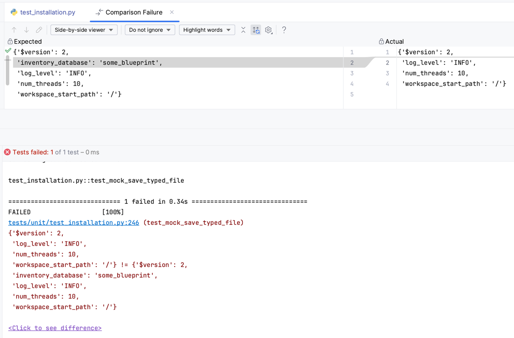

<!-- FOR CONTRIBUTORS: Edit this file in Visual Studio Code with the recommended extensions, so that we update the table of contents automatically -->
Databricks Labs Blueprint
===

[](https://github.com/databrickslabs/blueprint/actions/workflows/push.yml)
[](https://codecov.io/github/databrickslabs/blueprint) []([https://codecov.io/github/databrickslabs/blueprint](https://github.com/databrickslabs/blueprint))


Baseline for Databricks Labs projects written in Python. Sources are validated with `mypy` and `pylint`. See [Contributing instructions](CONTRIBUTING.md) if you would like to improve this project.

<!-- TOC -->
* [Databricks Labs Blueprint](#databricks-labs-blueprint)
* [Installation](#installation)
* [Batteries Included](#batteries-included)
  * [Basic Terminal User Interface (TUI) Primitives](#basic-terminal-user-interface-tui-primitives)
    * [Simple Text Questions](#simple-text-questions)
    * [Confirming Actions](#confirming-actions)
    * [Single Choice from List](#single-choice-from-list)
    * [Single Choice from Dictionary](#single-choice-from-dictionary)
    * [Multiple Choices from Dictionary](#multiple-choices-from-dictionary)
    * [Unit Testing Prompts](#unit-testing-prompts)
  * [Nicer Logging Formatter](#nicer-logging-formatter)
    * [Rendering on Dark Background](#rendering-on-dark-background)
    * [Rendering in Databricks Notebooks](#rendering-in-databricks-notebooks)
    * [Integration With Your App](#integration-with-your-app)
    * [Integration with `console_script` Entrypoints](#integration-with-consolescript-entrypoints)
  * [Parallel Task Execution](#parallel-task-execution)
    * [Collecting Results](#collecting-results)
    * [Collecting Errors from Background Tasks](#collecting-errors-from-background-tasks)
    * [Strict Failures from Background Tasks](#strict-failures-from-background-tasks)
  * [Application and Installation State](#application-and-installation-state)
    * [Install Folder](#install-folder)
    * [Detecting Current Installation](#detecting-current-installation)
    * [Detecting Installations From All Users](#detecting-installations-from-all-users)
    * [Saving `@dataclass` configuration](#saving-dataclass-configuration)
    * [Saving CSV files](#saving-csv-files)
    * [Loading `@dataclass` configuration](#loading-dataclass-configuration)
    * [Brute-forcing `SerdeError` with `as_dict()` and `from_dict()`](#brute-forcing-serdeerror-with-asdict-and-fromdict)
    * [Configuration Format Evolution](#configuration-format-evolution)
    * [Uploading Untyped Files](#uploading-untyped-files)
    * [Listing All Files in the Install Folder](#listing-all-files-in-the-install-folder)
    * [Unit Testing Installation State](#unit-testing-installation-state)
    * [Assert Rewriting with PyTest](#assert-rewriting-with-pytest)
  * [Application State Migrations](#application-state-migrations)
  * [Building Wheels](#building-wheels)
    * [Released Version Detection](#released-version-detection)
    * [Unreleased Version Detection](#unreleased-version-detection)
    * [Application Name Detection](#application-name-detection)
    * [Using `ProductInfo` with integration tests](#using-productinfo-with-integration-tests)
    * [Publishing Wheels to Databricks Workspace](#publishing-wheels-to-databricks-workspace)
  * [Databricks CLI's `databricks labs ...` Router](#databricks-clis-databricks-labs--router)
    * [Account-level Commands](#account-level-commands)
    * [Commands with interactive prompts](#commands-with-interactive-prompts)
    * [Integration with Databricks Connect](#integration-with-databricks-connect)
    * [Starting New Projects](#starting-new-projects)
* [Notable Downstream Projects](#notable-downstream-projects)
* [Project Support](#project-support)
<!-- TOC -->

# Installation

You can install this project via `pip`:

```
pip install databricks-labs-blueprint
```

# Batteries Included

This library contains a proven set of building blocks, tested in production through [UCX](https://github.com/databrickslabs/ucx) and projects.

## Basic Terminal User Interface (TUI) Primitives

Your command-line apps do need testable interactivity, which is provided by `from databricks.labs.blueprint.tui import Prompts`. Here are some examples of it:


It is also integrated with our [command router](#commands-with-interactive-prompts). 

[[back to top](#databricks-labs-blueprint)]

### Simple Text Questions

Use `prompts.question()` as a bit more involved than `input()` builtin:

```python
from databricks.labs.blueprint.tui import Prompts

prompts = Prompts()
answer = prompts.question('Enter a year', default='2024', valid_number=True)
print(answer)
```


Optional arguments are:

* `default` (str) - use given value if user didn't input anything
* `max_attempts` (int, default 10) - number of attempts to throw exception after invalid or empty input
* `valid_number` (bool) - input has to be a valid number
* `valid_regex` (bool) - input has to be a valid regular expression
* `validate` - function that takes a string and returns boolean, like `lambda x: 'awesome' in x`, that could be used to further validate input.

[[back to top](#databricks-labs-blueprint)]

### Confirming Actions

Use `prompts.confirm()` to guard any optional or destructive actions of your app:

```python
if prompts.confirm('Destroy database?'):
    print('DESTROYING DATABASE')
```


[[back to top](#databricks-labs-blueprint)]

### Single Choice from List

Use to select a value from a list:

```python
answer = prompts.choice('Select a language', ['Python', 'Rust', 'Go', 'Java'])
print(answer)
```


[[back to top](#databricks-labs-blueprint)]

### Single Choice from Dictionary

Use to select a value from the dictionary by showing users sorted dictionary keys:

```python
answer = prompts.choice_from_dict('Select a locale', {
    'Українська': 'ua',
    'English': 'en'
})
print(f'Locale is: {answer}')
```


[[back to top](#databricks-labs-blueprint)]

### Multiple Choices from Dictionary

Use to select multiple items from dictionary

```python
answer = prompts.multiple_choice_from_dict(
    'What projects are written in Python? Select [DONE] when ready.', {
    'Databricks Labs UCX': 'ucx',
    'Databricks SDK for Python': 'sdk-py',
    'Databricks SDK for Go': 'sdk-go',
    'Databricks CLI': 'cli',
})
print(f'Answer is: {answer}')
```


[[back to top](#databricks-labs-blueprint)]

### Unit Testing Prompts

Use `MockPrompts` with regular expressions as keys and values as answers. The longest key takes precedence.

```python
from databricks.labs.blueprint.tui import MockPrompts

def test_ask_for_int():
    prompts = MockPrompts({r".*": ""})
    res = prompts.question("Number of threads", default="8", valid_number=True)
    assert "8" == res
```

[[back to top](#databricks-labs-blueprint)]

## Nicer Logging Formatter

There's a basic logging configuration available for [Python SDK](https://github.com/databricks/databricks-sdk-py?tab=readme-ov-file#logging), but the default output is not pretty and is relatively inconvenient to read. Here's how make output from Python's standard logging facility more enjoyable to read:

```python
from databricks.labs.blueprint.logger import install_logger

install_logger()

import logging
logging.root.setLevel("DEBUG") # use only for development or demo purposes

logger = logging.getLogger("name.of.your.module")
logger.debug("This is a debug message")
logger.info("This is an table message")
logger.warning("This is a warning message")
logger.error("This is an error message", exc_info=KeyError(123))
logger.critical("This is a critical message")
```

Here are the assumptions made by this formatter:

 * Most likely you're forwarding your logs to a file already, this log formatter is mainly for visual consumption.
 * The average app or Databricks Job most likely finishes running within a day or two, so we display only hours, minutes, and seconds from the timestamp.
 * We gray out debug messages, and highlight all other messages. Errors and fatas are additionally painted with red.
 * We shorten the name of the logger to a readable chunk only, not to clutter the space. Real-world apps have deeply nested folder structures and filenames like `src/databricks/labs/ucx/migration/something.py`, which translate into `databricks.labs.ucx.migration.something` fully-qualified Python module names, that get reflected into `__name__` [top-level code environment](https://docs.python.org/3/library/__main__.html#what-is-the-top-level-code-environment) special variable, that you idiomatically use with logging as `logger.getLogger(__name__)`. This log formatter shortens the full module path to a more readable `d.l.u.migration.something`, which is easier to consume from a terminal screen or a notebook. 
 * We only show the name of the thread if it's other than `MainThread`, because the overwhelming majority of Python applications are single-threaded.

[[back to top](#databricks-labs-blueprint)]

### Rendering on Dark Background

Here's how the output would look like on dark terminal backgrounds, including those from GitHub Actions:


[[back to top](#databricks-labs-blueprint)]

### Rendering in Databricks Notebooks

And here's how things will appear when executed from Databricks Runtime as part of notebook or a workflow:


[[back to top](#databricks-labs-blueprint)]

### Integration With Your App

Just place the following code in your wheel's top-most `__init__.py` file:

```python
from databricks.labs.blueprint.logger import install_logger

install_logger(level="INFO")
```

And place this idiomatic 

```python
# ... insert this into the top of your file
from databricks.labs.blueprint.entrypoint import get_logger

logger = get_logger(__file__)
# ... top of the file insert end
```

... and you'll be able to benefit from the readable console stderr formatting everywhere 

Each time you'd need to turn on debug logging, just invoke `logging.root.setLevel("DEBUG")` (even in notebook).

[[back to top](#databricks-labs-blueprint)]

### Integration with `console_script` Entrypoints

When you invoke Python as an entry point to your wheel (also known as `console_scripts`), [`__name__` top-level code environment](https://docs.python.org/3/library/__main__.html#what-is-the-top-level-code-environment) would always be equal to `__main__`. But you really want to get the logger to be named after your Python module and not just `__main__` (see [rendering in Databricks notebooks](#rendering-in-databricks-notebooks)).

If you create a `dist/logger.py` file with the following contents:

```python
from databricks.labs.blueprint.entrypoint import get_logger, run_main

logger = get_logger(__file__)

def main(first_arg, second_arg, *other):
    logger.info(f'First arg is: {first_arg}')
    logger.info(f'Second arg is: {second_arg}')
    logger.info(f'Everything else is: {other}')
    logger.debug('... and this message is only shown when you are debugging from PyCharm IDE')

if __name__ == '__main__':
    run_main(main)
```

... and invoke it with `python dist/logger.py Hello world, my name is Serge`, you should get back the following output.

```
13:46:42  INFO [dist.logger] First arg is: Hello
13:46:42  INFO [dist.logger] Second arg is: world,
13:46:42  INFO [dist.logger] Everything else is: ('my', 'name', 'is', 'Serge')
```

Everything is made easy thanks to `run_main(fn)` helper.

[[back to top](#databricks-labs-blueprint)]

## Parallel Task Execution

Python applies global interpreter lock (GIL) for compute-intensive tasks, though IO-intensive tasks, like calling Databricks APIs through Databricks SDK for Python, are not subject to GIL. It's quite a common task to perform multiple different API calls in parallel, though it is overwhelmingly difficult to do multi-threading right. `concurrent.futures import ThreadPoolExecutor` is great, but sometimes we want something even more high level. This library helps you navigate the most common road bumps.

[[back to top](#databricks-labs-blueprint)]

### Collecting Results

This library helps you filtering out empty results from background tasks, so that the downstream code is generally simpler. We're also handling the thread pool namind, so that the name of the list of tasks properly gets into log messages. After all background tasks completed their execution, we log something like `Finished 'task group name' tasks: 50% results available (2/4). Took 0:00:00.000604`.

```python
from databricks.labs.blueprint.parallel import Threads

def not_really_but_fine():
    logger.info("did something, but returned None")

def doing_something():
    logger.info("doing something important")
    return f'result from {doing_something.__name__}'

logger.root.setLevel('DEBUG')
tasks = [not_really_but_fine, not_really_but_fine, doing_something, doing_something]
results, errors = Threads.gather("task group name", tasks)

assert ['result from doing_something', 'result from doing_something'] == results
assert [] == errors
```

This will log the following messages:

```
14:20:15 DEBUG [d.l.blueprint.parallel] Starting 4 tasks in 20 threads
14:20:15  INFO [dist.logger][task_group_name_0] did something, but returned None
14:20:15  INFO [dist.logger][task_group_name_1] did something, but returned None
14:20:15  INFO [dist.logger][task_group_name_1] doing something important
14:20:15  INFO [dist.logger][task_group_name_1] doing something important
14:20:15  INFO [d.l.blueprint.parallel][task_group_name_1] task group name 4/4, rps: 7905.138/sec
14:20:15  INFO [d.l.blueprint.parallel] Finished 'task group name' tasks: 50% results available (2/4). Took 0:00:00.000604
```

[[back to top](#databricks-labs-blueprint)]

### Collecting Errors from Background Tasks

Inspired by Go Language's idiomatic error handling approach, this library allows for collecting errors from all of the background tasks and handle them separately. For all other cases, we recommend using [strict failures](#strict-failures-from-background-tasks)

```python
from databricks.sdk.errors import NotFound
from databricks.labs.blueprint.parallel import Threads

def works():
    return True

def fails():
    raise NotFound("something is not right")

tasks = [works, fails, works, fails, works, fails, works, fails]
results, errors = Threads.gather("doing some work", tasks)

assert [True, True, True, True] == results
assert 4 == len(errors)
```

This will log the following messages:

```
14:08:31 ERROR [d.l.blueprint.parallel][doing_some_work_0] doing some work task failed: something is not right: ...
...
14:08:31 ERROR [d.l.blueprint.parallel][doing_some_work_3] doing some work task failed: something is not right: ...
14:08:31 ERROR [d.l.blueprint.parallel] More than half 'doing some work' tasks failed: 50% results available (4/8). Took 0:00:00.001011
```

[[back to top](#databricks-labs-blueprint)]

### Strict Failures from Background Tasks

Use `Threads.strict(...)` to raise `ManyError` with the summary of all failed tasks:

```python
from databricks.sdk.errors import NotFound
from databricks.labs.blueprint.parallel import Threads

def works():
    return True

def fails():
    raise NotFound("something is not right")

tasks = [works, fails, works, fails, works, fails, works, fails]
results = Threads.strict("doing some work", tasks)

# this line won't get executed
assert [True, True, True, True] == results
```

This will log the following messages:

```
...
14:11:46 ERROR [d.l.blueprint.parallel] More than half 'doing some work' tasks failed: 50% results available (4/8). Took 0:00:00.001098
...
databricks.labs.blueprint.parallel.ManyError: Detected 4 failures: NotFound: something is not right
```

[[back to top](#databricks-labs-blueprint)]

## Application and Installation State

There always needs to be a location, where you put application code, artifacts, and configuration. 
The `Installation` class is used to manage the `~/.{product}` folder on WorkspaceFS to track [typed files](#saving-dataclass-configuration).
It provides methods for serializing and deserializing objects of a specific type, as well as managing the [storage location](#install-folder) 
for those objects. The class includes methods for loading and saving objects, uploading and downloading
files, and managing the installation folder.

The `Installation` class can be helpful for unit testing by allowing you to mock the file system and control
the behavior of the [`load`](#loading-dataclass-configuration) and [`save`](#saving-dataclass-configuration) methods. 
See [unit testing](#unit-testing-installation-state) for more details.

[[back to top](#databricks-labs-blueprint)]

### Install Folder

The `install_folder` method returns the path to the installation folder on WorkspaceFS. The installation folder 
is used to store typed files that are managed by the `Installation` class. [Publishing wheels](#publishing-wheels-to-databricks-workspace) 
update the `version.json` file in the install folder.

When integration testing, you may want to have a [random installation folder](#using-productinfo-with-integration-tests) for each test execution.

If an `install_folder` argument is provided to the constructor of the `Installation` class, it will be used
as the installation folder. Otherwise, the installation folder will be determined based on the current user's
username. Specifically, the installation folder will be `/Users/{user_name}/.{product}`, where `{user_name}`
is the username of the current user and `{product}` is the [name of the product](#application-name-detection)
 associated with the installation. Here is an example of how you can use the `install_folder` method:

```python
from databricks.sdk import WorkspaceClient
from databricks.labs.blueprint.installation import Installation

# Create an Installation object for the "blueprint" product
install = Installation(WorkspaceClient(), "blueprint")

# Print the path to the installation folder
print(install.install_folder())
# Output: /Users/{user_name}/.blueprint
```

In this example, the `Installation` object is created for the "blueprint" product. The `install_folder` method
is then called to print the path to the installation folder. The output will be `/Users/{user_name}/.blueprint`,
where `{user_name}` is the username of the current user.

You can also provide an `install_folder` argument to the constructor to specify a custom installation folder.
Here is an example of how you can do this:

```python
from databricks.sdk import WorkspaceClient
from databricks.labs.blueprint.installation import Installation

# Create an Installation object for the "blueprint" product with a custom installation folder
install = Installation(WorkspaceClient(), "blueprint", install_folder="/my/custom/folder")

# Print the path to the installation folder
print(install.install_folder())
# Output: /my/custom/folder
```

In this example, the `Installation` object is created for the "blueprint" product with a custom installation
folder of `/my/custom/folder`. The `install_folder` method is then called to print the path to the installation
folder. The output will be `/my/custom/folder`.

[[back to top](#databricks-labs-blueprint)]

### Detecting Current Installation

`Installation.current(ws, product)` returns the `Installation` object for the given product in the current workspace.

If the installation is not found, a `NotFound` error is raised. If `assume_user` argument is True, the method
will assume that the installation is in the user's home directory and return it if found. If False, the method
will only return an installation that is in the `/Applications` directory.

```python
from databricks.sdk import WorkspaceClient
from databricks.labs.blueprint.installation import Installation

ws = WorkspaceClient()

# current user installation
installation = Installation.assume_user_home(ws, "blueprint")
assert "/Users/foo/.blueprint" == installation.install_folder()
assert not installation.is_global()

# workspace global installation
installation = Installation.current(ws, "blueprint")
assert "/Applications/blueprint" == installation.install_folder()
assert installation.is_global()
```

[[back to top](#databricks-labs-blueprint)]

### Detecting Installations From All Users

`Installation.existing(ws, product)` Returns a collection of all existing installations for the given product in the current workspace.

This method searches for installations in the root /Applications directory and home directories of all users in the workspace. 
Let's say, users `foo@example.com` and `bar@example.com` installed `blueprint` product in their home folders. The following
code will print `/Workspace/bar@example.com/.blueprint` and `/Workspace/foo@example.com/.blueprint`:

```python
from databricks.sdk import WorkspaceClient
from databricks.labs.blueprint.installation import Installation

ws = WorkspaceClient()

global_install = Installation.assume_global(ws, 'blueprint')
global_install.upload("some.bin", b"...")

user_install = Installation.assume_user_home(ws, 'blueprint')
user_install.upload("some.bin", b"...")

for blueprint in Installation.existing(ws, "blueprint"):
  print(blueprint.install_folder())
```

[[back to top](#databricks-labs-blueprint)]

### Saving `@dataclass` configuration

The `save(obj)` method saves a dataclass instance of type `T` to a file on WorkspaceFS. If no `filename` is provided, 
the name of the `type_ref` class will be used as the filename. Any missing parent directories are created automatically.
If the object has a `__version__` attribute, the method will add a `version` field to the serialized object
with the value of the `__version__` attribute. See [configuration format evolution](#configuration-format-evolution) 
for more details. `save(obj)` works with JSON and YAML configurations without the need to supply `filename` keyword 
attribute. When you need to save [CSV files](#saving-csv-files), the `filename` attribute is required. If you need to 
upload arbitrary and untyped files, use the [`upload()` method](#uploading-untyped-files).

Here is an example of how you can use the `save` method:

```python
from databricks.sdk import WorkspaceClient
from databricks.labs.blueprint.installation import Installation

install = Installation(WorkspaceClient(), "blueprint")

@dataclass
class MyClass:
    field1: str
    field2: str

obj = MyClass('value1', 'value2')
install.save(obj)

# Verify that the object was saved correctly
loaded_obj = install.load(MyClass)
assert loaded_obj == obj
```

In this example, the `Installation` object is created for the "blueprint" product. A dataclass object of type
`MyClass` is then created and saved to a file using the `save` method. The object is then loaded from the file
using the [`load` method](#loading-dataclass-configuration) and compared to the original object to verify that 
it was saved correctly.

[[back to top](#databricks-labs-blueprint)]

### Saving CSV files

You may need to upload a CSV file to Databricks Workspace, so that it's easier editable from a Databricks Workspace UI 
or tools like Google Sheets or Microsoft Excel. If non-technical humands don't need to edit application state,
use [dataclasses](#saving-dataclass-configuration) for configuration. CSV files currently don't support 
[format evolution](#configuration-format-evolution).

The following example will save `workspaces.csv` file with two records and a header:

```python
from databricks.sdk import WorkspaceClient
from databricks.sdk.service.provisioning import Workspace
from databricks.labs.blueprint.installation import Installation

installation = Installation(WorkspaceClient(), "blueprint")

installation.save([
  Workspace(workspace_id=1234, workspace_name="first"),
  Workspace(workspace_id=1235, workspace_name="second"),
], filename="workspaces.csv")

# ~ $ databricks workspace export /Users/foo@example.com/.blueprint/workspaces.csv
# ... workspace_id,workspace_name
# ... 1234,first
# ... 1235,second
```

[[back to top](#databricks-labs-blueprint)]

### Loading `@dataclass` configuration

The `load(type_ref[, filename])` method loads an object of type `type_ref` from a file on WorkspaceFS. If no `filename` is
provided, the `__file__` attribute of `type_ref` will be used as the filename, otherwise the library will figure out the name
based on a class name.

```python
from databricks.sdk import WorkspaceClient
from databricks.labs.blueprint.installation import Installation

@dataclass
class SomeConfig:  # <-- auto-detected filename is `some-config.json`
    version: str

ws = WorkspaceClient()
installation = Installation.current(ws, "blueprint")
cfg = installation.load(SomeConfig)

installation.save(SomeConfig("0.1.2"))
installation.assert_file_written("some-config.json", {"version": "0.1.2"})
```

[[back to top](#databricks-labs-blueprint)]

### Brute-forcing `SerdeError` with `as_dict()` and `from_dict()`

In the rare circumstances when you cannot use [@dataclass](#loading-dataclass-configuration) or you get `SerdeError` that you cannot explain, you can implement `from_dict(cls, raw: dict) -> 'T'` and `as_dict(self) -> dict` methods on the class:

```python
from databricks.sdk import WorkspaceClient
from databricks.labs.blueprint.installation import Installation

class SomePolicy:
    def __init__(self, a, b):
        self._a = a
        self._b = b

    def as_dict(self) -> dict:
        return {"a": self._a, "b": self._b}

    @classmethod
    def from_dict(cls, raw: dict):
        return cls(raw.get("a"), raw.get("b"))

    def __eq__(self, o):
        assert isinstance(o, SomePolicy)
        return self._a == o._a and self._b == o._b

policy = SomePolicy(1, 2)
installation = Installation.current(WorkspaceClient(), "blueprint")
installation.save(policy, filename="backups/policy-123.json")
load = installation.load(SomePolicy, filename="backups/policy-123.json")

assert load == policy
```

[[back to top](#databricks-labs-blueprint)]

### Configuration Format Evolution

As time progresses, your application evolves. So does the configuration file format with it. This library provides
a common utility to seamlessly evolve configuration file format across versions, providing callbacks to convert
from older versions to newer. If you need to migrate configuration or database state of the entire application, 
use the [application state migrations](#application-state-migrations).

If the type has a `__version__` attribute, the method will check that the version of the object in the file
matches the expected version. If the versions do not match, the method will attempt to migrate the object to
the expected version using a method named `v{actual_version}_migrate` on the `type_ref` class. If the migration
is successful, the method will return the migrated object. If the migration is not successful, the method will
raise an `IllegalState` exception. Let's say, we have `/Users/foo@example.com/.blueprint/config.yml` file with
only the `initial: 999` as content, which is from older installations of the `blueprint` product:

```python
from databricks.sdk import WorkspaceClient
from databricks.labs.blueprint.installation import Installation

@dataclass
class EvolvedConfig:
    __file__ = "config.yml"
    __version__ = 3

    initial: int
    added_in_v1: int
    added_in_v2: int

    @staticmethod
    def v1_migrate(raw: dict) -> dict:
        raw["added_in_v1"] = 111
        raw["version"] = 2
        return raw

    @staticmethod
    def v2_migrate(raw: dict) -> dict:
        raw["added_in_v2"] = 222
        raw["version"] = 3
        return raw

installation = Installation.current(WorkspaceClient(), "blueprint")
cfg = installation.load(EvolvedConfig)

assert 999 == cfg.initial
assert 111 == cfg.added_in_v1  # <-- added by v1_migrate()
assert 222 == cfg.added_in_v2  # <-- added by v2_migrate()
```

[[back to top](#databricks-labs-blueprint)]

### Uploading Untyped Files

The `upload(filename, raw_bytes)` and `upload_dbfs(filename, raw_bytes)` methods upload raw bytes to a file on 
WorkspaceFS (or DBFS) with the given `filename`, creating any missing directories where required. This method 
is used to upload files that are not typed, i.e., they do not use the [`@dataclass` decorator](#saving-dataclass-configuration).

```python
installation = Installation(ws, "blueprint")

target = installation.upload("wheels/foo.whl", b"abc")
assert "/Users/foo/.blueprint/wheels/foo.whl" == target
```

The most common example is a [wheel](#building-wheels), which we already integrate with `Installation` framework.

[[back to top](#databricks-labs-blueprint)]

### Listing All Files in the Install Folder

You can use `files()` method to recursively list all files in the [install folder](#install-folder).

[[back to top](#databricks-labs-blueprint)]

### Unit Testing Installation State

You can create a `MockInstallation` object and use it to override the default installation folder and the contents 
of the files in that folder. This allows you to test the of your code in different scenarios, such as when a file 
is not found or when the contents of a file do not match the expected format. 


For example, you have the following `WorkspaceConfig` class that is serialized into `config.yml` on your workspace:

```python
@dataclass
class WorkspaceConfig:
  __file__ = "config.yml"
  __version__ = 2

  inventory_database: str
  connect: Config | None = None
  workspace_group_regex: str | None = None
  include_group_names: list[str] | None = None
  num_threads: int | None = 10
  database_to_catalog_mapping: dict[str, str] | None = None
  log_level: str | None = "INFO"
  workspace_start_path: str = "/"
```

Here's the only code necessary to verify that specific content got written:

```python
from databricks.labs.blueprint.installation import MockInstallation

installation = MockInstallation()

installation.save(WorkspaceConfig(inventory_database="some_blueprint"))

installation.assert_file_written("config.yml", {
  "version": 2,
  "inventory_database": "some_blueprint",
  "log_level": "INFO",
  "num_threads": 10,
  "workspace_start_path": "/",
})
```

This method is far superior than directly comparing raw bytes content via mock:

```python
ws.workspace.upload.assert_called_with(
  "/Users/foo/.blueprint/config.yml",
  yaml.dump(
    {
      "version": 2,
      "num_threads": 10,
      "inventory_database": "some_blueprint",
      "include_group_names": ["foo", "bar"],
      "workspace_start_path": "/",
      "log_level": "INFO",
    }
  ).encode("utf8"),
  format=ImportFormat.AUTO,
  overwrite=True,
)
```

And it's even better if you use PyTest, where we have even [deeper integration](#assert-rewriting-with-pytest).

[[back to top](#databricks-labs-blueprint)]

### Assert Rewriting with PyTest

If you are using [PyTest](https://docs.pytest.org/), then add this to your `conftest.py`, so that
the assertions are more readable:

```python
import pytest

pytest.register_assert_rewrite('databricks.labs.blueprint.installation')
```



[[back to top](#databricks-labs-blueprint)]

## Application State Migrations

As time goes by, your applications evolve as well, requiring the addition of new columns to database schemas, 
changes of the database state, or some migrations of configured workflows. This utility allows you to do seamless 
upgrades from version X to version Z through version Y. Idiomatic usage in your deployment automation is as follows:

```python
from ... import Config
from databricks.sdk import WorkspaceClient
from databricks.labs.blueprint.upgrades import Upgrades
from databricks.labs.blueprint.wheels import ProductInfo

product_info = ProductInfo.from_class(Config)
ws = WorkspaceClient(product=product_info.product_name(), product_version=product_info.version())
installation = product_info.current_installation(ws)
config = installation.load(Config)
upgrades = Upgrades(product_info, installation)
upgrades.apply(ws)
```

The upgrade process loads the version of [the product](#application-name-detection) that is about to be installed from `__about__.py` file that
declares the [`__version__` variable](#released-version-detection). This version is compares with the version currently installed on
the Databricks Workspace by loading it from the `version.json` file in the [installation folder](#install-folder). This file is kept
up-to-date automatically if you use the [databricks.labs.blueprint.wheels.WheelsV2](#publishing-wheels-to-databricks-workspace).

If those versions are different, the process looks for the `upgrades` folder next to `__about__.py` file and
computes a difference for the upgrades in need to be rolled out. Every upgrade script in that directory has to
start with a valid SemVer identifier, followed by the alphanumeric description of the change,
like `v0.0.1_add_service.py`. Each script has to expose a function that takes [`Installation`](#installation) and
`WorkspaceClient` arguments to perform the relevant upgrades. Here's the example:

```python
from ... import Config

import logging, dataclasses
from databricks.sdk import WorkspaceClient
from databricks.labs.blueprint.installation import Installation

upgrade_logger = logging.getLogger(__name__)

def upgrade(installation: Installation, ws: WorkspaceClient):
    upgrade_logger.info(f"creating new automated service user for the installation")
    config = installation.load(Config)
    service_principal = ws.service_principals.create(display_name='blueprint-service')
    new_config = dataclasses.replace(config, application_id=service_principal.application_id)
    installation.save(new_config)
```

To prevent the same upgrade script from being applies twice, we use `applied-upgrades.json` file in
the installation directory. At the moment, there's no `downgrade(installation, ws)`, but it can easily be added in 
the future versions of this library.

[[back to top](#databricks-labs-blueprint)]

## Building Wheels

We recommend deploying applications as wheels, which are part of the [application installation](#application-and-installation-state). But versioning, testing, and deploying those is often a tedious process.

### Released Version Detection

When you deploy your Python app as a wheel, every time it has to have a different version. This library detects `__about__.py` file automatically anywhere in the project root and reads `__version__` variable from it. We support [SemVer](https://semver.org/) versioning scheme. [Publishing wheels](#publishing-wheels-to-databricks-workspace) update `version.json` file in the [install folder](#install-folder).

```python
from databricks.labs.blueprint.wheels import ProductInfo

product_info = ProductInfo(__file__)
version = product_info.released_version()
logger.info(f'Version is: {version}')
```

[[back to top](#databricks-labs-blueprint)]

### Unreleased Version Detection

When you develop your wheel and iterate on testing it, it's often required to upload a file with different name each time you build it. We use `git describe --tags` command to fetch the latest SemVer-compatible tag (e.g. `v0.0.2`) and append the number of commits with timestamp to it. For example, if the released version is `v0.0.1`, then the unreleased version would be something like `0.0.2+120240105144650`. We verify that this version is compatible with both SemVer and [PEP 440](https://peps.python.org/pep-0440/). [Publishing wheels](#publishing-wheels-to-databricks-workspace) update `version.json` file in the [install folder](#install-folder).

```python
product_info = ProductInfo(__file__)

version = product_info.unreleased_version()
is_git = product_info.is_git_checkout()
is_unreleased = product_info.is_unreleased_version()

logger.info(f'Version is: {version}')
logger.info(f'Git checkout: {is_git}')
logger.info(f'Is unreleased: {is_unreleased}')
```

[[back to top](#databricks-labs-blueprint)]

### Application Name Detection

Library can infer the name of application by taking the directory name when `__about__.py` file is located within the current project. See [released version detection](#released-version-detection) for more details.
[`ProductInfo.for_testing(klass)`](#using-productinfo-with-integration-tests) creates a new `ProductInfo` object with a random `product_name`.

```python
from databricks.labs.blueprint.wheels import ProductInfo

product_info = ProductInfo(__file__)
logger.info(f'Product name is: {product_info.product_name()}')
```

[[back to top](#databricks-labs-blueprint)]

### Using `ProductInfo` with integration tests

When you're integration testing your [installations](#installation), you may want to have different [installation folders](#install-folder) for each test execution. `ProductInfo.for_testing(klass)` helps you with this:

```python
from ... import ConfigurationClass
from databricks.labs.blueprint.wheels import ProductInfo

first = ProductInfo.for_testing(ConfigurationClass)
second = ProductInfo.for_testing(ConfigurationClass)
assert first.product_name() != second.product_name()
```

[[back to top](#databricks-labs-blueprint)]

### Publishing Wheels to Databricks Workspace

Before you execute a wheel on Databricks, you have to build it and upload it. This library provides detects [released](#released-version-detection) or [unreleased](#unreleased-version-detection) version of the wheel, copies it over to a temporary folder, changes the `__about__.py` file with the right version, and builds the wheel in the temporary location, so that it's not polluted with build artifacts. `Wheels` is a context manager, so it removes all temporary files and folders ather `with` block finishes. This library is successfully used to concurrently test wheels on Shared Databricks Clusters through notebook-scoped libraries. Before you deploy the new version of the wheel, it is highly advised that you perform [application state upgrades](#application-state-migrations).

Every call `wheels.upload_to_wsfs()` updates `version.json` file in the [install folder](#install-folder), which holds `version` field with the current wheel version. There's also `wheel` field, that contains the path to the current wheel file on WorkspaceFS.

```python
from databricks.sdk import WorkspaceClient
from databricks.labs.blueprint.wheels import ProductInfo

w = WorkspaceClient()
product_info = ProductInfo(__file__)
installation = product_info.current_installation(w)

with product_info.wheels(w) as wheels:
    remote_wheel = wheels.upload_to_wsfs()
    logger.info(f'Uploaded to {remote_wheel}')
```

This will print something like:

```
15:08:44  INFO [dist.logger] Uploaded to /Users/serge.smertin@databricks.com/.blueprint/wheels/databricks_labs_blueprint-0.0.2+120240105150840-py3-none-any.whl
```

You can also do `wheels.upload_to_dbfs()`, though you're not able to set any access control over it.

[[back to top](#databricks-labs-blueprint)]

## Databricks CLI's `databricks labs ...` Router

This library contains common utilities for Databricks CLI entrypoints defined in [`labs.yml`](labs.yml) file. Here's the example metadata for a tool named `blueprint` with a single `me` command and flag named `--greeting`, that has `Hello` as default value:

```yaml
---
name: blueprint
description: Common libraries for Databricks Labs
install:
  script: src/databricks/labs/blueprint/__init__.py
entrypoint: src/databricks/labs/blueprint/__main__.py
min_python: 3.10
commands:
  - name: me
    description: shows current username
    flags:
     - name: greeting
       default: Hello
       description: Greeting prefix
```

And here's the content for [`src/databricks/labs/blueprint/__main__.py`](src/databricks/labs/blueprint/__main__.py) file, that executes `databricks labs blueprint me` command with `databricks.sdk.WorkspaceClient` automatically injected into an argument with magical name `w`:

```python
from databricks.sdk import WorkspaceClient
from databricks.labs.blueprint.entrypoint import get_logger
from databricks.labs.blueprint.cli import App

app = App(__file__)
logger = get_logger(__file__)


@app.command
def me(w: WorkspaceClient, greeting: str):
    """Shows current username"""
    logger.info(f"{greeting}, {w.current_user.me().user_name}!")


if "__main__" == __name__:
    app()
```

[[back to top](#databricks-labs-blueprint)]

### Account-level Commands

As you may have noticed, there were only workspace-level commands, but you can also nave native account-level command support. You need to specify the `is_account` property when declaring it in `labs.yml` file:

```yaml
commands:
  # ...
  - name: workspaces
    is_account: true
    description: shows current workspaces
```

and `@app.command(is_account=True)` will get you `databricks.sdk.AccountClient` injected into `a` argument:

```python
from databricks.sdk import AccountClient

@app.command(is_account=True)
def workspaces(a: AccountClient):
    """Shows workspaces"""
    for ws in a.workspaces.list():
        logger.info(f"Workspace: {ws.workspace_name} ({ws.workspace_id})")
```

[[back to top](#databricks-labs-blueprint)]

### Commands with interactive prompts

If your command needs some terminal interactivity, simply add [`prompts: Prompts` argument](#basic-terminal-user-interface-tui-primitives) to your command:

```python
from databricks.sdk import WorkspaceClient
from databricks.labs.blueprint.entrypoint import get_logger
from databricks.labs.blueprint.cli import App
from databricks.labs.blueprint.tui import Prompts

app = App(__file__)
logger = get_logger(__file__)


@app.command
def me(w: WorkspaceClient, prompts: Prompts):
    """Shows current username"""
    if prompts.confirm("Are you sure?"):
        logger.info(f"Hello, {w.current_user.me().user_name}!")

if "__main__" == __name__:
    app()
```

[[back to top](#databricks-labs-blueprint)]

### Integration with Databricks Connect

Invoking Sparksession using Databricks Connect

```python
from databricks.sdk import WorkspaceClient
from databricks.connect import DatabricksSession

@app.command
def example(w: WorkspaceClient):
    """Building Spark Session using Databricks Connect"""
    spark = DatabricksSession.builder().sdk_config(w.config).getOrCreate()
    spark.sql("SHOW TABLES")
```

[[back to top](#databricks-labs-blueprint)]

### Starting New Projects

This tooling makes it easier to start new projects. First, install the CLI:

```
databricks labs install blueprint
```

After, create new project in a designated directory:

```
databricks labs blueprint init-project --target /path/to/folder
```

[[back to top](#databricks-labs-blueprint)]

# Notable Downstream Projects

This library is used in the following projects:

- [UCX - Automated upgrade to Unity Catalog](https://github.com/databrickslabs/ucx)

[[back to top](#databricks-labs-blueprint)]

# Project Support

Please note that this project is provided for your exploration only and is not 
formally supported by Databricks with Service Level Agreements (SLAs). They are 
provided AS-IS, and we do not make any guarantees of any kind. Please do not 
submit a support ticket relating to any issues arising from the use of this project.

Any issues discovered through the use of this project should be filed as GitHub 
[Issues on this repository](https://github.com/databrickslabs/blueprint/issues). 
They will be reviewed as time permits, but no formal SLAs for support exist.
